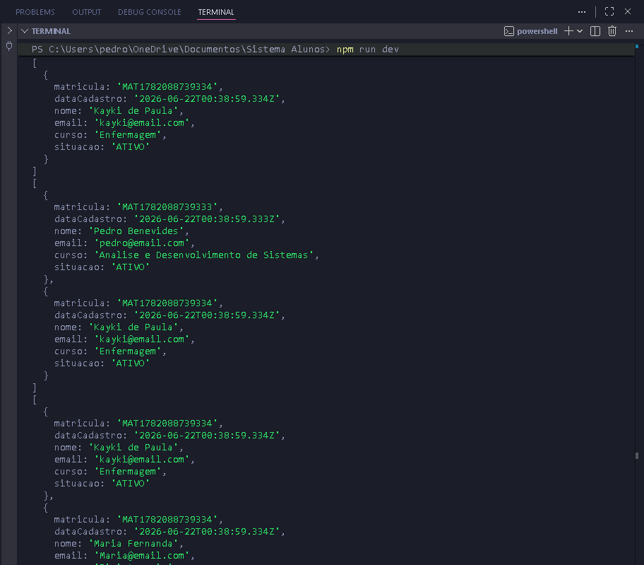

# 🎓 Sistema de Gerenciamento de Alunos

Projeto de gerenciamento de alunos desenvolvido em **TypeScript**, utilizando conceitos de **Programação Orientada a Objetos (POO)**, **Generics**, **DTOs** e **Repository Pattern**.

O sistema permite realizar operações de cadastro, consulta, atualização e remoção de alunos, além de disponibilizar funcionalidades de busca, filtragem e ordenação de dados.

---

## 📋 Funcionalidades

* Cadastro de alunos
* Busca por matrícula
* Listagem de alunos
* Atualização da situação acadêmica
* Remoção de alunos
* Busca por e-mail
* Filtro por curso
* Filtro por situação
* Ordenação alfabética por nome

---

## 🛠 Tecnologias Utilizadas

* TypeScript
* Node.js
* Programação Orientada a Objetos (POO)

---

## 📁 Estrutura do Projeto

```text
src/
│
├── aluno.ts
├── repository.ts
├── AlunoService.ts
├── filtrar.ts
└── index.ts
```

### aluno.ts

Responsável pelos tipos e enumerações do sistema.

* `Aluno`
* `CriarAlunoDTO`
* `SituacaoAluno`

### repository.ts

Implementa um repositório genérico utilizando Generics.

Funcionalidades:

* Salvar registros
* Buscar por matrícula
* Listar registros
* Atualizar registros
* Deletar registros

### AlunoService.ts

Camada responsável pelas regras de negócio.

* Cadastro de alunos
* Validação de e-mail único
* Busca por matrícula
* Atualização de situação
* Exclusão de alunos

### filtrar.ts

Funções auxiliares para consultas e filtros.

* Filtrar por curso
* Filtrar por situação
* Ordenar por nome
* Buscar por e-mail

---

## 🚀 Como Executar

### Instalar dependências

```bash
npm install
```

### Executar o projeto

```bash
npm run dev
```

---

## 💻 Exemplo de Uso

### Cadastro

```typescript
service.cadastrar({
    nome: "Pedro Benevides",
    email: "pedro@email.com",
    curso: "Análise e Desenvolvimento de Sistemas",
    situacao: SituacaoAluno.ATIVO
})
```

### Buscar por E-mail

```typescript
const alunos = service.listarTodos()

console.log(
    buscarPorEmail(alunos, "pedro@email.com")
)
```

### Filtrar por Curso

```typescript
console.log(
    filtrarPorCurso(alunos, "Enfermagem")
)
```

### Ordenar por Nome

```typescript
console.log(
    ordenarPorNome(alunos)
)
```

---

## 📸 Demonstração

### Execução do Sistema



---

## 🧠 Conceitos Aplicados

### TypeScript

* Tipagem estática
* Generics
* Type Aliases
* Utility Types (`Omit` e `Partial`)
* Enums

### Programação Orientada a Objetos

* Classes
* Encapsulamento
* Composição
* Separação de responsabilidades

### Arquitetura

* Repository Pattern
* DTO (Data Transfer Object)
* Camada de Serviço (Service Layer)

### Estruturas e Algoritmos

* Busca com `find`
* Filtragem com `filter`
* Ordenação com `sort`
* Comparação de strings com `localeCompare`

---


## 👨‍💻 Autor

Pedro Henrique

Projeto desenvolvido para estudos e evolução em TypeScript, Programação Orientada a Objetos e desenvolvimento backend.
